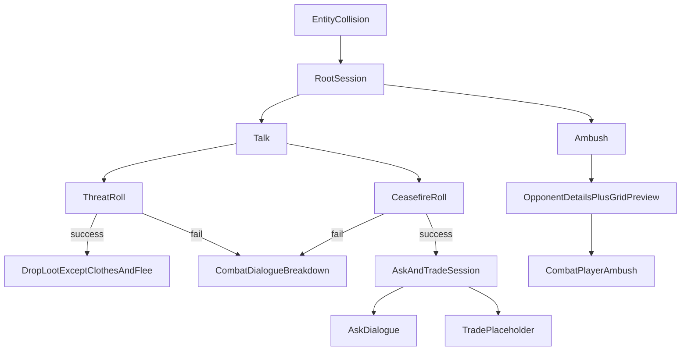

# Entity Collision System Overhaul (COMPLETED)

> **July 19, 2026:** Shipped. The named `MacroEventHud` in this plan is
> implemented as `MacroExplorationStage` under `MacroHudController`. Do not
> reopen this plan for feature work; extend the live collision resolver instead.

## Goal

Replace the separate [`MacroInteractionPanel`](WorldCore/MacroInteractionPanel.gd) collision UI with the shared [`MacroEventHud`](UI/HUD/Macro/MacroEventHud.gd) frame, and expand the encounter tree:



## Design decisions (locked)

- **Remove ROB** entirely (enum, resolver path, UI, tests).
- **Talk tree:** `THREAT` or `CEASEFIRE` only.
- **Threat success:** opponent drops everything **except clothes**, then flees (`WITHDRAWN` + unload token). Clothes = worn body slots: `INNER_TORSO`, `OUTER_TORSO`, `LEGS`, `FEET`, `HEAD`, `EYES`, `FACE`, `NECK`, `ARMS`. Dropped = hands, offhand, vest, belt, sling, backpack contents, and all backpack/vest stored items (drop to ground at hex).
- **Ceasefire success:** do **not** immediately separate; open a peaceful session with **ASK** + **TRADE**. Entity stays `CEASEFIRE` for the session; leaving/closing ends the encounter without combat.
- **ASK:** generic choice set for procedural NPCs; unique choice set keyed by NPC dialogue profile when present.
- **TRADE:** visible choice when the NPC “allows trade”; opens a **placeholder** result (“Trade unavailable — economy system pending”). Some NPCs lock Trade with a reason chip.
- **Ambush:** keep FAR / STANDARD / CLOSE; root + ambush views show **opponent details** and a **combat grid preview**.

## Architecture

### 1. Single presentation surface

- Route collisions through [`MacroHudController.open_event`](UI/HUD/Macro/MacroHudController.gd) / `show_event_result` (same path as macro events).
- Stop calling `interaction_panel.open_entity_collision` from [`MacroGameManager.begin_entity_collision`](WorldCore/MacroGameManager.gd).
- Keep `MacroInteractionPanel` temporarily unused (or remove from [`main_world.tscn`](WorldCore/main_world.tscn) once wiring is clean) to avoid two modal systems.
- Extend session dictionaries with optional `mode` / `preview` fields so Event HUD can render collision-specific chrome without forking a second modal.

### 2. Session builder + choice router

Add a dedicated builder (preferred: new [`WorldCore/MacroEntityCollisionResolver.gd`](WorldCore/MacroEntityCollisionResolver.gd)) that returns Event-HUD-shaped sessions:

```gdscript
{
  id, title, body, image_path, tags, choices[], can_close,
  mode,            # "collision_root" | "talk" | "ambush" | "peaceful" | "ask"
  opponent,        # summary for tags/body
  grid_preview,    # lane markers for ambush options
}
```

[`MacroGameManager`](WorldCore/MacroGameManager.gd) becomes the router:

- `begin_entity_collision` → build root session → `macro_hud.open_event`
- On `event_choice_submitted`, if pending type is `ENTITY_COLLISION`, dispatch by `choice_id` (`talk`, `ambush`, `threat`, `ceasefire`, `ambush_far`, …, `ask`, `trade`, `ask_*`, `leave`) instead of treating it as a macro event.

Reuse existing `event_choice_submitted` / `event_closed` signals; branch inside the manager by `_pending_interaction.type`.

### 3. Root session: opponent details + grid preview

Populate opponent summary from `EntityRecord.definition` + runtime when available:

- Name/archetype, faction, agenda, combat tactic, pillars (B/F/Fo/W), threat-relevant tags
- Loadout highlights (primary weapon / armor names) without opening inventory UI

**Combat grid preview:** lightweight schematic inside Event HUD (prefer embedding under/near `ImageFrame`, or replace image content when `grid_preview` is present):

- 12-lane strip mirroring [`EncounterBuilder`](CombatCore/EncounterBuilder.gd) spawn math (player FAR=1 / STANDARD=3 / CLOSE=4, enemy=7 for player ambush)
- Root shows a default “ordinary” or “selected ambush” layout; Ambush sub-session updates preview as the player focuses FAR/STANDARD/CLOSE (preview text on each choice + live schematic update if easy; otherwise static schematic + per-choice spawn preview strings)

### 4. Talk resolution changes

Update [`MacroInteractionResolver`](WorldCore/MacroInteractionResolver.gd):

- Remove `ROB` / `ROB_SUCCESS` / `resolve_rob_transfer` (or leave transfer helper only if useful for threat loot — prefer a new `resolve_threat_surrender`).
- **Threat success:** new `resolve_threat_surrender(...)` that builds ground-drop item states from enemy loadout/runtime, keeping clothes slots equipped conceptually (those items are not dropped). Roll which non-clothes gear actually drops (seeded RNG — e.g. each eligible item drops with high probability / always drop held+storage, roll on optional junk). Message lists what hit the ground.
- **Ceasefire success:** set `EntityWorldStatus.CEASEFIRE`, keep token loaded, open peaceful session (ASK / TRADE / LEAVE).
- Fail either roll → `_request_pending_combat(DIALOGUE_BREAKDOWN)` as today.

Enums in [`GameEnums.gd`](SystemCore/GameEnums.gd):

- `TalkAction`: drop `ROB`
- `NegotiationOutcome`: drop `ROB_SUCCESS`; add nothing unless needed (`THREAT_SUCCESS` alias of `INTIMIDATED` is fine)

### 5. ASK (conversation choices)

Prototype content in the collision resolver (same pattern as [`MacroEventResolver`](WorldCore/MacroEventResolver.gd)):

- **Generic** (procedural NPCs): 3–5 choices — e.g. ask intent, ask about area, ask to leave, probe weakness (mostly flavor + light effects: time/exertion or info tags; no deep quest graph yet).
- **Unique:** lookup by `definition.dialogue_id` (new optional string on definition state). If set and a profile exists, use that choice set; else fall back to generic.
- Seed one sample unique profile (hardcoded table entry) to prove the hook; remaining uniques can be authored later.

Add optional `dialogue_id: String` (+ optional `allows_trade: bool`, default true for generic) into definition dictionary serialization paths used by world entities (`EntityDefinition.to_state` / `from_state` and procedural spawn writers).

### 6. TRADE placeholder

- If `allows_trade`: enabled choice → result panel: title/body explaining trade UI/economy is not ready; Continue returns to peaceful session.
- If not: locked choice with reason (e.g. “Refuses to barter”).
- No item value fields, no trade screen scene in this pass.

### 7. Ambush path

Unchanged combat entry: `resolve_entity_ambush` → `PLAYER_AMBUSH` + position. Only presentation changes (Event HUD choices + grid preview).

### 8. Tests / smoke

Update/replace interaction smokes:

- [`Tests/MacroInteractionSmoke.gd`](Tests/MacroInteractionSmoke.gd) — open via Event HUD; threat loot-except-clothes; ceasefire → ask/trade; ambush still requests combat.
- [`Tests/MacroEventHudSmoke.gd`](Tests/MacroEventHudSmoke.gd) — still valid for narrative events; ensure collision sessions do not break event routing.
- Remove ROB expectations from any resolver tests.

## Key files to touch

| File | Change |
|------|--------|
| [`WorldCore/MacroGameManager.gd`](WorldCore/MacroGameManager.gd) | Collision → Event HUD; choice router; threat loot apply; ceasefire keeps session |
| [`WorldCore/MacroEntityCollisionResolver.gd`](WorldCore/MacroEntityCollisionResolver.gd) | **New** session/choice builder + ASK catalogs |
| [`WorldCore/MacroInteractionResolver.gd`](WorldCore/MacroInteractionResolver.gd) | Threat surrender; remove ROB |
| [`UI/HUD/Macro/MacroEventHud.gd`](UI/HUD/Macro/MacroEventHud.gd) (+ `.tscn` if needed) | Optional `grid_preview` / opponent tag rendering |
| [`UI/HUD/Macro/MacroHudController.gd`](UI/HUD/Macro/MacroHudController.gd) | Thin passthrough if needed |
| [`SystemCore/GameEnums.gd`](SystemCore/GameEnums.gd) | Drop ROB enums |
| [`BiologicalCore/EntityDefinition.gd`](BiologicalCore/EntityDefinition.gd) | `dialogue_id`, `allows_trade` |
| [`WorldCore/main_world.tscn`](WorldCore/main_world.tscn) | Drop/unwire `MacroInteractionPanel` |
| [`WorldCore/MacroInteractionPanel.gd`](WorldCore/MacroInteractionPanel.gd) | Delete or leave dead; prefer remove once unused |
| Tests under [`Tests/`](Tests/) | Cover new tree |

## Out of scope

- Real trade UI / item `value` / currency (placeholder only)
- Deep multi-branch quest dialogue authors beyond one unique sample + generic set
- Full reuse of live `CombatLaneView` duel widgets (schematic preview only)
