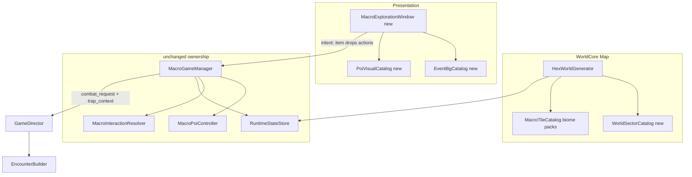

# Phase 2 — Macro Map + Exploration HUD (COMPLETED)

> **July 19, 2026:** Historical. Exploration window and trap loop remain live.
> Campaign travel is the July 16 directional Node Web, not infinite wedges.
> Deferred Pocket Map / UI pack chrome stay Phase 2.5.

## Scope decision

**In Phase 2 (now):**
- Goal 1 — Macro map: central inaccessible city core + 8 compass wedge zones + plains biome detail + sparse POI landmarks
- Goal 2 — Exploration interaction HUD: windowed, Neo Scavenger-inspired drag-drop SEARCH/CAMP with place visuals, sleep spot, trap slots, and full trap-to-combat on rest ambush

**Deferred to Phase 2.5 / later:**
- Goal 3 — Pocket Map always-on UI ([`Asset/UI/revampedHUD/POCKET INVENTORY (MAIN)/Sprites/Pixel Map/0.png`](Asset/UI/revampedHUD/POCKET%20INVENTORY%20(MAIN)/Sprites/Pixel%20Map/0.png), bulb, clock, compass, Time & weather atlas)
- Goal 4 — [`UI Assets pack_v.1_st/UI.png`](Asset/UI/revampedHUD/UI%20Assets%20pack_v.1_st/UI.png) official HUD chrome integration

**Rationale:** Map geography and interaction pacing are the game’s core loop. Polished retro chrome on top of a generic map and wizard menus would not fix the feel. Build systems first with **functional placeholder UI** (existing [`PresentationCore/HUDAssetLibrary.gd`](PresentationCore/HUDAssetLibrary.gd) styleboxes + simple panels), then skin in Phase 2.5.

**Still deferred post-Phase 2:** 4-direction arm cones (existing [`HexWorldGenerator.gd`](WorldCore/HexWorldGenerator.gd) arm geometry stays disabled until hub+wedge slice is proven).

---

## Assessment of the two in-scope goals

### Goal 1 — Macro map: Strong fit for Phase 2

Current generator ([`HexWorldGenerator.gd`](WorldCore/HexWorldGenerator.gd)) uses noise + random structure scatter; `handcrafted_sectors` is empty; entire hub radius is `is_poi`. Your target layout is achievable with existing infrastructure:

- **Central core:** Paint impassable city hexes from [`Asset/HexTiles/_BIOMES/biome_centralcore`](Asset/HexTiles/_BIOMES/biome_centralcore) (structures, walls, infrastructure)
- **8 wedges:** N / NE / E / SE / S / SW / W / NW — each a seeded procedural chunk using [`biome_plains`](Asset/HexTiles/_BIOMES/biome_plains) (HEX grass, flora, rocks, remnants, structures)
- **POIs:** Rare landmark hexes with specific structure sprites (homesteads, sheds, tanks) — not every structure hex

**Key engineering gap:** [`Tools/Build-HexTileSet.gd`](Tools/Build-HexTileSet.gd) merges all biomes into one global pool; [`HexMapVisualizer.gd`](WorldCore/HexMapVisualizer.gd) picks tiles by layer enum only, not biome pack. Phase 2 must add **biome-pack-aware tile resolution** so centralcore vs plains assets do not bleed together.

### Goal 2 — Exploration HUD: Strong fit, largest UI rewrite

Current [`MacroInteractionPanel.gd`](WorldCore/MacroInteractionPanel.gd) is a centered wizard with `OptionButton` tool slots. Target is a **windowed panel** (map stays visible) with:

- **SEARCH:** composite scene — Event_bg backdrop + POI prop sprites from hex tile paths
- **CAMP:** Sleep Spot (built-in bed vs player tent/sleeping bag) + Trap slots (drag item onto prop anchors)
- **Drag-drop:** reuse [`InventorySlot.gd`](UI/Inventory/InventorySlot.gd) pattern; backend stays [`MacroPoiController`](WorldCore/MacroPoiController.gd) / [`MacroInteractionResolver`](WorldCore/MacroInteractionResolver.gd)

**Interaction pacing fix (required):** stop auto-opening POI on step; open only via **Act** or landmark click ([`MacroGameManager._execute_player_step`](WorldCore/MacroGameManager.gd)).

**Trap combat (confirmed full scope):** camp trap persisted on hex → on rest/sleep interruption → [`EncounterBuilder`](CombatCore/EncounterBuilder.gd) receives trap context → lane object `TRAP` triggers on enemy entry ([`CombatLaneSlot.gd`](CombatCore/CombatLaneSlot.gd) already has trap interact hook).

---

## Architecture (in-scope systems)



Presentation emits intent; domain validates. No legality in UI scripts.

---

## Workstreams

### MW-01 — Zone layout and tile pipeline

**Files:** [`HexWorldGenerator.gd`](WorldCore/HexWorldGenerator.gd), [`MacroHexData.gd`](WorldCore/MacroHexData.gd), [`HexRecord`](SystemCore/HexRecord.gd), [`Tools/Build-HexTileSet.gd`](Tools/Build-HexTileSet.gd), [`MacroTileCatalog.gd`](WorldCore/MacroTileCatalog.gd), [`HexMapVisualizer.gd`](WorldCore/HexMapVisualizer.gd)

1. Add `MacroZone` / sector fields to hex data: `zone_id` (hub_core, wedge_N, …), `biome_pack` (`centralcore` | `plains`), `landmark_id` (empty for filler hexes)
2. Replace distance-only region logic with:
   - **Hub core:** radius ~2–3, impassable (`rock_layer = ROCKS` or explicit `passable = false`), tiles from `biome_centralcore`
   - **8 wedges:** compass partition from hub edge outward; each wedge gets deterministic seed suffix
3. Extend tile builder to tag sources with `biome_pack` + layer category; resolver picks from pack first
4. Procedural wedge fill (per hex):
   - Base grass from `biome_plains/HEX/grass_tiles`
   - Layer rolls: shrubs, trees, hills, remnants (common), structures (uncommon)
   - **Landmark roll:** ~3–8% of wedge hexes → `is_poi = true`, assign structure sprite id + `poi_id` (homestead, shed, warehouse, etc.)
5. Remove: hub-district POI on every hex, 1% `generic_ruins` spam
6. Re-run tile build; update [`Tests/HexVisualDeterminismSmoke.gd`](Tests/HexVisualDeterminismSmoke.gd) for wedge + impassable core (drop Phase 1 “all PLAINS biome” assertion where wedge variety requires it)

**Acceptance:** Demo start at hub edge; core city visible but blocked; walking into a wedge shows varied plains detail; POI hexes are sparse with distinct building tiles.

---

### MW-02 — Interaction pacing and landmark model

**Files:** [`MacroGameManager.gd`](WorldCore/MacroGameManager.gd), [`MacroSnapshotBuilder.gd`](WorldCore/MacroSnapshotBuilder.gd), [`WorldRules.gd`](WorldCore/WorldRules.gd)

1. POI panel opens only on **Act** at current landmark hex (or explicit landmark marker click), not on step
2. Only **landmark** hexes (`landmark_id` non-empty) open exploration window; filler structure hexes get optional quick “Scan rubble” later (out of scope unless trivial)
3. Hub `(0,0)` alone remains a special service POI (rest, meta stub); hub district hexes are safe travel only
4. Update [`Tests/MacroInteractionSmoke.gd`](Tests/MacroInteractionSmoke.gd) and [`Tests/Phase1VerticalSliceSmoke.gd`](Tests/Phase1VerticalSliceSmoke.gd) to use Act-based POI entry

---

### MW-03 — Asset catalogs (data-only, no official HUD chrome)

**New files:**
- `PresentationCore/EventBgCatalog.gd` — maps `poi_id` / structure type / flora → [`Asset/UI/Event_bg`](Asset/UI/Event_bg) composite (layered PNG paths or precomposed scene)
- `PresentationCore/PoiVisualCatalog.gd` — maps landmark → prop sprite paths under [`biome_plains/Structures`](Asset/HexTiles/_BIOMES/biome_plains/Structures) and [`flora`](Asset/HexTiles/_BIOMES/biome_plains/flora)
- `WorldCore/WorldSectorCatalog.gd` — wedge definitions: display name, POI density, hazard band, loot profile id

Catalogs are presentation/content data; generation reads sector catalog for wedge params.

---

### MW-04 — MacroExplorationWindow (Goal 2 shell)

**New:** `UI/Macro/MacroExplorationWindow.gd` + `.tscn`  
**Replaces:** wizard flow in [`MacroInteractionPanel.gd`](WorldCore/MacroInteractionPanel.gd) (keep collision TALK/AMBUSH here or split later)

**Layout (functional placeholder chrome):**
- Fixed-size window (~900×640), anchor bottom-right or center-right; **does not** fullscreen or hide map
- Left: **scene viewport** — Event_bg + 1–3 draggable prop sprites (door, crate, tree, bed)
- Right top: **SEARCH** — narrative text + drop targets on props (“Pick lock”, “Force door”, “Search crate”)
- Right bottom: **inventory strip** — compact row of [`InventorySlot`](UI/Inventory/InventorySlot.gd) from player snapshot
- Tab or toggle: **CAMP**
  - **Sleep Spot:** shows built-in anchor (bed/bench) + drop zone for tent/sleeping bag; comfort meter from item descriptors
  - **Trap:** 1–2 drop zones on prop anchors (door frame, brush line); shows attached trap icon
  - **Rest:** start rest loop (existing camp healing/fatigue logic); **Stop** button; vulnerable while resting

**Signals (unchanged contract):** same payloads as current panel → `MacroGameManager.resolve_poi_action` / preview callbacks.

**Simplify SEARCH vs Phase 1:** one primary scavenge action per landmark + optional tool-gated secondary (not 5 stacked search options).

---

### MW-05 — Drag-drop wiring

**Files:** new `UI/Macro/InteractionDropTarget.gd`, extend [`MacroPoiController`](WorldCore/MacroPoiController.gd) session snapshot

1. Drag payload: `{ instance_id, item_id, interaction_roles }` (mirror inventory slot)
2. Drop targets declare accepted roles/tags (`SEARCH_TOOL`, `CAMP_GEAR`, new `TRAP_GEAR`)
3. Drop → updates `selected_item_ids` / trap slot state → calls existing `preview_poi_action` / submit pipeline
4. Visual feedback: highlight valid targets (green/red) — simple ColorRect overlays, no v1 atlas yet

---

### MW-06 — CAMP sleep, rest, and trap persistence

**Files:** [`HexRecord`](SystemCore/HexRecord.gd), [`MacroPoiController.gd`](WorldCore/MacroPoiController.gd), [`MacroInteractionResolver.gd`](WorldCore/MacroInteractionResolver.gd)

**Hex record additions:**
```text
sleep_anchor: String          # built-in spot type (bed, bench, ground)
sleep_gear_instance_id: String
camp_traps: Array             # { instance_id, anchor_id, lane_index }
rest_in_progress: bool
```

1. **Sleep Spot:** base comfort from anchor; add sleeping bag/tent bonuses from item descriptors (`camp_sleep_bonus`, etc.)
2. **Rest:** multi-turn heal/fatigue (existing camp loop) with explicit stop; macro input blocked; NPC turns still advance (interruption possible)
3. **Trap install:** consuming or equipping trap item onto anchor; persist in `camp_traps`
4. Add `InteractionItemRole.TRAP_GEAR` to [`GameEnums.gd`](SystemCore/GameEnums.gd) for items like `trap_makeshift`

---

### MW-07 — Trap-to-combat full loop

**Files:** [`MacroGameManager.gd`](WorldCore/MacroGameManager.gd), [`GameDirector.gd`](SystemCore/GameDirector.gd), [`EncounterBuilder.gd`](CombatCore/EncounterBuilder.gd), [`CombatLaneManager`](CombatCore/CombatLaneManager.gd) / lane setup

1. On camp interruption or collision during `rest_in_progress` / sleep → combat request includes:
   ```text
   trap_context: { lane_index, trap_item_id, trap_instance_id, trigger_on_entry: true }
   ```
2. `EncounterBuilder` places `CombatRules.TileObject.TRAP` on nominated lane index before spawn
3. First enemy movement into trapped lane: apply trap effect (damage/stance from item data), consume trap, remove from hex record
4. Smoke: rest at POI with trap → force NPC collision → verify trap fires and entity record clears trap

---

## Recommended execution order

```text
1. MW-01  Tile pipeline + wedge generation     (map must exist first)
2. MW-02  Interaction pacing + landmark model  (quick win, unblocks testing)
3. MW-03  EventBg + PoiVisual catalogs         (parallel with MW-04)
4. MW-04  Exploration window shell             (placeholder UI)
5. MW-05  Drag-drop                            (depends on MW-04)
6. MW-06  Sleep / rest / trap persistence      (depends on MW-05)
7. MW-07  Trap combat hook                     (depends on MW-06)
8. Tests    Update macro smokes + new exploration smoke
```

---

## Phase 2 exit criteria (revised)

- Hub core is impassable and visually distinct (centralcore tiles)
- 8 wedge zones generate deterministic, detailed plains hexes with sparse POI landmarks
- Stepping through world does **not** auto-open menus; Act at landmark opens window
- Exploration window shows Event_bg + POI props; drag item to search/camp/trap targets
- CAMP: sleep spot + gear + rest with stop; trap persists on hex
- Ambush during rest triggers combat with trap on lane; trap fires once
- Phase 1 vertical slice still passes (with updated POI entry path)
- **Not required:** Pocket Map UI, UI pack v1 atlas, arm cones, official HUD art pass

---

## Risks and mitigations

| Risk | Mitigation |
|------|------------|
| Tile builder mixes biomes | Explicit `biome_pack` on catalog entries; visualizer filters by hex pack |
| Scope creep on drag-drop UX | Phase 2 = one landmark template + 3 drop targets; generalize later |
| Trap combat touches CombatCore | Minimal change: trap placement in EncounterBuilder + one trigger hook in turn start |
| Smoke test breakage | Update demo POI coords to landmark hex; Act to enter |

---

## What moves to Phase 2.5

- Pocket Map collapsed/expanded states (bulb, clock, compass −45°, light flicker)
- Time & weather icon from pack 2 atlas tied to world clock
- UI pack v1 frames, scroll panels, ornate bars for exploration window + WorldHUD
- Retire or slim down current [`WorldHUD.gd`](UI/HUD/WorldHUD.gd) in favor of pocket device chrome
