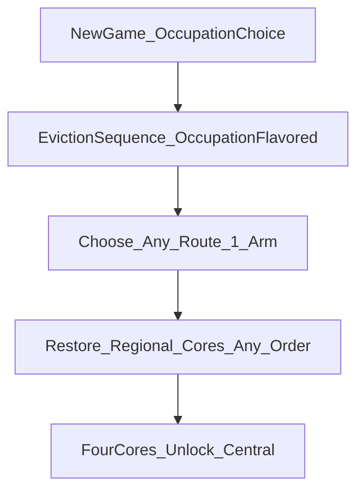

# Central Core Campaign Overhaul

Authoritative campaign implementation contract for Cursor/agents.
Docs-first build bible for eviction, the four-Arm Core campaign, and the live
Directional Node Web.

**Where this conflicts with soft Act 1 language elsewhere, this file wins.**

## July 2026 opening and Node Web contract (supersedes older Act 1 notes below)

The implemented opening no longer enters Central or forces a North-only first
step. New Game opens a resource-driven guided sequence:

1. Select exactly one occupation, one trait, and one flaw from the identity
   catalog. These stable IDs provide presentation text, rule tags, and the
   occupation's additions to the common starting loadout.
2. Confirm the identity, then play the occupation-flavored guided eviction.
3. Choose any of the four adjacent Route 1 nodes. The character enters that
   node facing inward from Central; the run never enters Central first.

The guided eviction is an illustrated narrative event, not a terminal-only
message. It must stage a Central administration office backdrop, a visible
eviction-clerk NPC distinct from The Operator, a named dialogue box, and the
occupation-flavored follow-up. The office image, NPC portrait, speaker name,
base dialogue, and occupation copy are resource-backed presentation data.
Terminal/CRT styling is limited to the dialogue and navigation chrome.

The post-eviction Node Web is governed by
[`WorldCore/campaign_graph.tres`](../../WorldCore/campaign_graph.tres):

- All four `*_random_1` nodes and their inner-ring links are open.
- **Current alpha:** the North Route 1 -> Route 2 -> Route 3 spine is open;
  East, South, and West Route 2/3, gateways, and Cores are visible but locked.
- **Long-term canon:** all four Arms become complete regional campaigns and the
  four Cores may be restored in any order. The alpha's North-only deep content
  is a delivery limitation, not canonical campaign order.
- Central is visible but cannot be entered until all four regional Core states
  have `restored = true`.
- North Route 2 and Route 3 own deterministic interior clusters. Hidden nodes
  and edges are absent from the map until a data-authored discovery trigger
  reveals them; hidden branches are never required for main progression.
- Every Route 1 node owns a fixed paved road from its Central-facing rim to its
  outward arm exit plus a dirt service spur. The road skeleton is independent
  of seed, player arrival, and discovery order.
- Exactly one inhabited starter settlement exists across the four Route 1
  nodes. The alpha locks it, its POI, and the stationary wayfinder to
  `north_random_1`; the other three nodes do not generate substitute
  settlements.
- Each visited Route 1 node owns a separate stationary Central Guard pair at
  its Central-facing road rim.

Core restoration and structural changes remain profile-wide Meta state. A new
character inherits restored Cores, while identity, chosen spawn, eviction, and
the generated/revealed graph remain run-local state. The four-Core requirement
is authored in
[`SystemCore/central_unlock_milestone.tres`](../../SystemCore/central_unlock_milestone.tres).

Any older instruction that says only North Route 1 is selectable, the inner
ring is closed, the player spawns on a Central fringe, or an NPC North Pointer
is required is retired and must not be implemented.

| Owns | Defers to |
| --- | --- |
| Act 1 campaign flow, travel seals, tutorial beats, phased IDE checklist | — |
| Folder taxonomy + sort SOP for hex biomes | — |
| Pack → dialect / Golbanc default / theme ramp detail | [Hex World Asset Overhaul](HEX_WORLD_ASSET_OVERHAUL.md) |
| Lore tone / eviction framing | [Canonical World Specification](../CANONICAL_WORLD_SPECIFICATION.md) |
| Official era chronology | [World Timeline Codex](../WORLD_TIMELINE_CODEX.md) |
| Domain ownership / presentation boundaries | [System Architecture](../SYSTEM_ARCHITECTURE.md) |
| FRAME/CORE dressing schema detail | [Hex Dressing Templates](HEX_DRESSING_TEMPLATES.md) |
| Generated 469-cell composition, roads, settlement uniqueness, persistence, validation | [Hex World Generator V2](HEX_WORLD_GENERATOR_V2.md) |
| Supporting Node Web lore alignment | [Macro World Overhaul](MACRO_WORLD_OVERHAUL.md) |

No gameplay code is required to treat this file as the build queue. Implement
phases in order. Do not reopen finished Phase 2 foundation plans.

---

## 1. Purpose and ownership

This file is the single IDE entry point for the Central Core / Act 1 overhaul.
Agents should implement from here first; open sibling docs only for the deferred
columns above.

### Non-goals

- Player-facing cosmic exposition (Marks, Primal Civilization, The
  Transcendence, full Core purpose)
- Baking roads, pipes, or power lines into terrain-base hex PNGs
- Shipping four complete Arms in the current alpha milestone
- Treating Central as free midgame home after eviction
- Treating temporary locked E/S/W deep routes as long-term canon
- Rewriting Node Web radius, Meta persistence, or domain ownership
- TRADE economy, Macro SNIPE, Pocket Map, and future combat-content expansion
  (Known Gaps only)

---

## 2. Campaign contract and alpha boundary

### Hard rules

- **Central hub art**
  (`Asset/HexTiles/_BIOMES/biome_centralcore/central_core_hub_main.png`)
  is the official Central Core city silhouette — visual authority, not a free
  midgame home.
- After eviction, **Central is locked** for that character until all four
  regional Cores are restored (endgame).
- Player deploys directly to any chosen `*_random_1` node, facing inward from
  Central; the run does not enter Central first.
- All four Route 1 nodes and inner-ring links are open.
- Current alpha locks only the unfinished deep East/South/West content. Future
  milestones remove those locks without changing the campaign premise.
- Occupation choice **flavors exile text / starting kit**, not which arm opens.
- Regional Cores are non-linear. Central unlock observes all four persistent
  restore states and never requires North to be first.

### Eviction sequence (stub)

Tone: paperwork and scarcity, not destiny. Logs/NPCs talk rations, quotas,
sealed gates — never cosmology.

| Beat | Intent |
| --- | --- |
| Occupation select | Scavenger first; other occupations TBD stubs |
| Exile briefing | Occupation-flavored copy; triage language |
| Arm selection | Choose any Route 1 deployment after eviction |
| Direct deployment | Enter chosen node from its Central-facing rim |
| Central lock | Re-entry refused until four regional restores |

#### Occupation flavor (exile text / kit only)

| `occupation_id` | Exile flavor (stub) | Starting kit note |
| --- | --- | --- |
| `scavenger` | Quota shortfall / salvage surplus triage | Ship first |
| *(TBD)* | Additional occupations later | Do not gate arm choice |

### Post-eviction spawn rules

1. Set run state: `eviction_completed = true`, `central_locked = true`.
2. Place player at the chosen Route 1 node's Central-facing rim, **not** inside
   `central_core`.
3. Refuse travel into `central_core` interior / re-entry while `central_locked`.
4. Unlock all four Route 1 nodes and their inner-ring travel.
5. In the alpha only, leave unfinished deep E/S/W nodes visible but locked.

### North guidance (optional alpha content hint)

| Field | Spec |
| --- | --- |
| Trigger | Player requests guidance or encounters the starter wayfinder |
| Actor | NPC or scripted POI/event (directions and survival tone) |
| Player outcome | Identifies currently complete North content without making it canonically mandatory |
| State | Optional one-shot guidance; never a Core-order prerequisite |
| Dialogue tone | Directions and survival tips; never destiny briefing |

### Node Map onboarding

| Step | Behavior |
| --- | --- |
| 1 | Open Node Map (coach / forced once) |
| 2 | Fit all four Route 1 choices and Central lock state |
| 3 | Highlight the player's selected/occupied Route 1 node |
| 4 | Render unfinished deep routes as locked alpha content, not forbidden canon |
| 5 | Closing map does not force a regional Core order |

### Temporary deep-content locks (current alpha)

Owners: `MacroProgressController` (destination legality) + Meta flags +
`NodeMapGraphView` (grey presentation).

Refuse when any of:

- Destination is an unfinished East/South/West Route 2/3, gateway, or Core while
  the alpha content-lock profile is active
- Destination is Central interior while `central_locked`

Allow:

- Local wander inside current radius-12 zone
- Travel among all four Route 1 nodes through authored inner-ring links
- North Route 1→2→3 unlock progression
- North gateway / core only via existing Meta unseal rules

---

## 3. Systems file map

| File | Job |
| --- | --- |
| [`WorldCore/MacroGraphGenerator.gd`](../../WorldCore/MacroGraphGenerator.gd) | Four-node starter-ring unlocks and authored deep-content availability |
| [`WorldCore/MacroProgressController.gd`](../../WorldCore/MacroProgressController.gd) | Directional destination legality and Central lock |
| [`SystemCore/MetaProgressionStore.gd`](../../SystemCore/MetaProgressionStore.gd) | Persistent Core state and structural patches; not regional order |
| [`WorldCore/MacroGameManager.gd`](../../WorldCore/MacroGameManager.gd) | Direct chosen-arm deployment and Central re-entry refusal |
| [`UI/NodeMap/NodeMapGraphView.gd`](../../UI/NodeMap/NodeMapGraphView.gd) | Grey locked nodes/edges; pulse highlight |
| [`UI/NodeMap/NodeMapSystem.gd`](../../UI/NodeMap/NodeMapSystem.gd) | Open-with-focus animation; tutorial coach |
| [`BiologicalCore/Identity/OccupationDefinition.gd`](../../BiologicalCore/Identity/OccupationDefinition.gd) | Occupation + exile copy hooks |
| [`WorldCore/MacroZoneGenerator.gd`](../../WorldCore/MacroZoneGenerator.gd) | Place `central_core_hub_main` as Central landmark CORE; dressing runtime |
| [`WorldCore/HexMapVisualizer.gd`](../../WorldCore/HexMapVisualizer.gd) | Render hub stamp / biome pack visuals |
| [`Tools/Build-HexTileSet.gd`](../../Tools/Build-HexTileSet.gd) | Rebuild TileSet + `MacroTileCatalog` after asset sort |

Presentation emits intent only. Travel legality and Meta flags live in WorldCore
/ SystemCore owners.

### Meta flags (Act 1)

| Flag | Meaning |
| --- | --- |
| `eviction_completed` | Exile sequence finished this character/run contract |
| `central_locked` | Refuse Central re-entry until four-Core endgame |
| `tutorial_north_pointed` | Legacy/optional alpha hint; never a progression prerequisite |
| `act1_arm_seals` | Legacy alpha lock name; must not encode long-term Core order |
| `gateway_north_unsealed` | Existing Meta restore flag (north climax) |

---

## 4. Asset pipeline — `S:\Asset\_Asset` → project biomes

**Pack identity, Golbanc Era 8 default, and homestead→theme ramp** are owned by
[Hex World Asset Overhaul](HEX_WORLD_ASSET_OVERHAUL.md). That file wins on pack
→ dialect conflicts. Summary for Act 1 agents:

| Source on `S:\Asset\_Asset` | Target / pool | Dialect use |
| --- | --- | --- |
| Brutalist Metropole, `central_core*` hubs | `biome_centralcore` / `central` | Central admin / dense hub |
| Archology South | `south` (later) | South dock / logistics tease |
| Hercynian Lowlands | `east` (later); Act 1 plains-adjacent scraps OK | East wet lowlands |
| Golbanc Homestead | `default_era8` → promote under plains / shared | Homestead starters on approaches |
| Gallian Ice Field / `_BIOMES/biomes_snow` | `biome_snow` / `north` | Far-north / cold rim |
| Arid Badlands | `west_basin` (later) | West tease stubs |
| Exo-Lunar Desolation, Gloria Station | scrap / `shared_props` | West scrap / Meta sites later |
| Starlight Menagerie | vehicles/props (non-hex terrain) | Combat/world props |
| `HEXIFY/*` | Prefer over raw pack dupes | Hex-ready first |
| `S:\Asset\_Asset\_BIOMES\*` | Merge into matching `res://Asset/HexTiles/_BIOMES/` | Already-sorted staging |

### Folder taxonomy (enforced under each `biome_*`)

| Folder | Contents |
| --- | --- |
| `HEX/` | Terrain-only base hexes (512² preferred; catalog via Build-HexTileSet) |
| `Infrastructure/` | Roads, pipes, power lines, tanks, poles (OVERLAY / FRAME pools) |
| `Structures/` | CORE building footprints |
| `Colony Infrastructure/` | Shared camp/colony props (or fold into `Infrastructure/`) |
| `flora/`, `Rocks/`, `remnants/`, `water_*` | As applicable per biome |
| Biome root (rare) | Multi-hex landmark stamps only (e.g. `central_core_hub_main.png`) |

### Sort SOP

1. Inventory S: pack → classify (terrain / overlay / structure / prop / discard)
2. Prefer HEXIFY variants when both exist
3. Copy into `res://Asset/HexTiles/_BIOMES/biome_<id>/...` with stable names
4. Tag for dressing pools (CORE / FRAME / ACCENT / OVERLAY)
5. Rebuild TileSet / catalog (`Tools/Build-HexTileSet.gd`)
6. Smoke: same seed → same placement

Act 1 promote priority: Brutalist/hub → Golbanc → snow north ramp → shared
props. Detail: Hex World Asset Overhaul.

---

## 5. Hex structure rules

Agent-checkable bullets (extends [Hex Dressing Templates](HEX_DRESSING_TEMPLATES.md)):

- Base hex = **terrain only**; never bake roads/pipes into grass/concrete bases
- Roads = shipped **OVERLAY** families covering all 64 six-edge masks for paved
  and dirt surfaces. Power and pipes remain future overlay families.
- FRAME anchors fixed; CORE swaps; props have **no gameplay authority**
- Central ring recipe: multi-hex HUB stamp using official hub PNG + surrounding
  STRUCTURE / ADMIN cells
- Radius-12 composition order: terrain → rings/wedges → trails → roles →
  templates → light scatter
- Footprint classes: `1x1_center`, `tall`, `wide`, multi-hex hub stamps
- Majority of cells stay quiet so landmarks read
- Templated hexes do not receive random-offset scatter on the same FRAME slots

---

## 6. Infrastructure generation status

- **Shipped:** 64 paved and 64 dirt 512×512 road masks, shared reciprocal
  sockets, catalog IDs, fixed Route 1 arterial planning, and service spurs.
- **Remaining:** Central-specific road variants, power lines/pylons, pipe runs,
  tanks, and expanded light-pole/crate families.
- Road, pipe, and power presentation must remain overlays or fitted props; none
  may become terrain or gameplay authority.

---

## 7. Phased IDE build order

### Phase 0 — Docs (this pass)

- **Files:** this MD; pointer edits in Macro World Overhaul, docs index, glossary
- **Done when:** agents can implement Act 1 from this file without hunting five
  competing plans
- **Acceptance:** linked from [READMEs/README.md](../README.md)

### Phase 1 — Asset sort pass

- **Files:** `Asset/HexTiles/_BIOMES/biome_centralcore/`, `biome_plains/`,
  `Tools/Build-HexTileSet.gd`, tile catalogs
- **Jobs:** Central + plains from S:/HEXIFY; wire hub PNG; rebuild catalog
- **Done when:** hub stamp path resolves; biome folders obey taxonomy
- **Acceptance:** visualizer loads hub CORE; catalog smoke / manual Godot check

### Phase 2 — Starter-ring topology and alpha content locks

- **Files:** `MacroGraphGenerator.gd`, `MacroProgressController.gd`,
  `MetaProgressionStore.gd`
- **Jobs:** keep all four Route 1 nodes and inner-ring links open; refuse only
  unfinished deep E/S/W content; enforce Central lock after eviction
- **Done when:** every Route 1 start works and Central re-entry is refused while
  `central_locked`
- **Acceptance:** Node Map/travel smokes cover four starts, inner-ring travel,
  deep alpha locks, and Central refusal

### Phase 3 — Eviction + occupation flavor

- **Files:** `MacroGameManager.gd`, Occupation defs, Meta flags, exile copy
- **Jobs:** eviction sequence; scavenger-first flavor; set `eviction_completed`
  / `central_locked`
- **Done when:** new run deploys to the chosen Route 1 rim with Central locked
- **Acceptance:** New Game → each arm choice; Central travel refused

### Phase 4 — Node Map onboarding / optional North hint

- **Files:** pointer POI/event, `NodeMapGraphView.gd`, `NodeMapSystem.gd`, Meta
  `tutorial_north_pointed`
- **Jobs:** teach starter-ring selection and lock presentation; optional NPC may
  point toward the alpha's complete North content without gating travel
- **Done when:** onboarding works and never forces a canonical first Core
- **Acceptance:** live probe from all four starts; optional hint persists without
  affecting legality

### Phase 5 — Central look

- **Files:** `MacroZoneGenerator.gd`, central zone profiles, hub stamp wiring
- **Jobs:** ring recipes / hub density using official art
- **Done when:** Central reads as overcrowded administrative seat; hub silhouette
  authoritative
- **Acceptance:** visual pass vs hub PNG; composition stable for same seed

### Phase 6 — Dressing runtime

- **Files:** `MacroZoneGenerator.gd`, dressing template resources, pools
- **Jobs:** composition planner + FRAME/CORE resolve per Hex Dressing Templates
- **Done when:** templated roles beat free scatter on landmark hexes
- **Acceptance:** same seed → same placement; no roads baked into terrain bases

### Phase 7 — North spine content

- **Files:** north zone profiles, SiteCatalog copy, Meta north restore loop
- **Jobs:** Route 1→3 activity; North Regulator restore polish; fetch on north
  spine (not sealed east)
- **Done when:** normal pathing sequence with local wander; gateway unseal works
- **Acceptance:** playthrough `north_random_1` → north core restore hook

### Phase 8 — Roads / pipes / power overlays

- **Files:** Infrastructure art, OVERLAY pools, catalog wiring
- **Road status (2026-07-29): Done** — complete 64-mask paved and 64-mask dirt
  families, stable surface IDs, reciprocal sockets, and fixed starter-ring
  arterial placement.
- **Remaining jobs:** pipe and power overlay families; later Central-specific
  infrastructure variants.
- **Acceptance:** overlays place without altering terrain bases; road asset,
  determinism, composition, persistence, and visual smokes pass.

### Phase 9 — Complete non-linear regional campaigns

- **Jobs:** complete E/S/W chapters; expose all four Core campaigns without an
  authored order; combine restored simulation layers; finish Central endgame
- **Done when:** every Core order is legal and all-four milestone opens Central
- **Acceptance:** order/permutation coverage plus persistent Meta inheritance

---

## 8. Success criteria

- One agent can implement Act 1 without reading five other delivery plans first
- After eviction, all four Route 1 choices and inner-ring links are traversable
- Alpha-only deep locks are presented as unfinished content, not world canon
- No tutorial or milestone forces North as the first regional Core
- Assets from S: land in correct biome folders with hex rules obeyed
- Central hub reads as the official city and stays inaccessible post-eviction
- Same seed → stable zone composition / dressing
- Long-term design assigns North/network, East/people, West/industry, and
  South/economy layers that combine without changing Node Web or Meta ownership

---

## Related deferred gaps (not this queue)

- TRADE economy after Ceasefire
- Macro SNIPE remains unimplemented; service-rifle scope data is metadata only.
- Humanoid token coverage gaps
- Pocket Map / pocket-device chrome (Phase 2.5)
- Authored preset library across all campaign nodes
