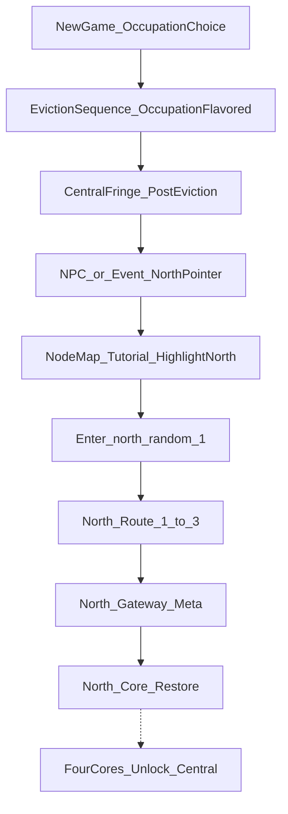

# Central Core Campaign Overhaul

Authoritative Act 1 implementation contract for Cursor/agents.
Docs-first build bible for eviction → North-tutorial play on the live
Directional Node Web.

**Where this conflicts with soft Act 1 language elsewhere, this file wins.**

| Owns | Defers to |
| --- | --- |
| Act 1 campaign flow, travel seals, tutorial beats, phased IDE checklist | — |
| Folder taxonomy + sort SOP for hex biomes | — |
| Pack → dialect / Golbanc default / theme ramp detail | [Hex World Asset Overhaul](HEX_WORLD_ASSET_OVERHAUL.md) |
| Lore tone / eviction framing | [Canonical World Specification](../CANONICAL_WORLD_SPECIFICATION.md) |
| Official era chronology | [World Timeline Codex](../WORLD_TIMELINE_CODEX.md) |
| Domain ownership / presentation boundaries | [System Architecture](../SYSTEM_ARCHITECTURE.md) |
| FRAME/CORE dressing schema detail | [Hex Dressing Templates](HEX_DRESSING_TEMPLATES.md) |
| Supporting Node Web lore alignment | [Macro World Overhaul](MACRO_WORLD_OVERHAUL.md) |

No gameplay code is required to treat this file as the build queue. Implement
phases in order. Do not reopen finished Phase 2 foundation plans.

---

## 1. Purpose and ownership

This file is the single IDE entry point for the Central Core / Act 1 overhaul.
Agents should implement from here first; open sibling docs only for the deferred
columns above.

### Non-goals

- Player-facing cosmic exposition (Marks, Primal Civilization, The
  Transcendence, full Core purpose)
- Baking roads, pipes, or power lines into terrain-base hex PNGs
- Shipping four full arms in Act 1
- Treating Central as free midgame home after eviction
- Optional thin E/S/W wander loops in Act 1
- Rewriting Node Web radius, Meta persistence, or domain ownership
- TRADE economy, SNIPE, EXECUTE, Pocket Map, squad combat (Known Gaps only)

---

## 2. Locked Act 1 contract

### Hard rules

- **Central hub art**
  (`Asset/HexTiles/_BIOMES/biome_centralcore/central_core_hub_main.png`)
  is the official Central Core city silhouette — visual authority, not a free
  midgame home.
- After eviction, **Central is locked** for that character until all four
  regional Cores are restored (endgame).
- Player starts on the **Central fringe / first exit**, not inside the locked hub.
- An **NPC or scripted event** (North Pointer Tutorial) points the player North,
  opens the Node Map, and **highlights the northern path with transition
  animation**.
- **E/S/W arms are greyed and non-traversable** for Act 1 (rim travel and Node
  Map both blocked). Inner-ring edges between `*_random_1` nodes do not open
  side-arm play.
- Occupation choice **flavors exile text / starting kit**, not which arm opens.
- Act 1 play begins at `north_random_1`; deeper north nodes unlock in order.
  Other `*_random_1` nodes stay visible-but-sealed teases.

### Eviction sequence (stub)

Tone: paperwork and scarcity, not destiny. Logs/NPCs talk rations, quotas,
sealed gates — never cosmology.

| Beat | Intent |
| --- | --- |
| Occupation select | Scavenger first; other occupations TBD stubs |
| Exile briefing | Occupation-flavored copy; triage language |
| Fringe spawn | Outside locked hub; Central re-entry refused |
| North pointer | Tutorial NPC/event; sets Meta tutorial flags |
| Node Map coach | One-shot open-map focus on `central_core → north_random_1` |

#### Occupation flavor (exile text / kit only)

| `occupation_id` | Exile flavor (stub) | Starting kit note |
| --- | --- | --- |
| `scavenger` | Quota shortfall / salvage surplus triage | Ship first |
| *(TBD)* | Additional occupations later | Do not gate arm choice |

### Post-eviction spawn rules

1. Set Meta: `eviction_completed = true`, `central_locked = true`.
2. Place player on Central fringe (rim / first-exit cell), **not** on the hub
   CORE stamp hex.
3. Refuse travel into `central_core` interior / re-entry while `central_locked`.
4. Unlock for travel: `north_random_1` only among arm Route-1 nodes.
5. Leave E/S/W Route-1 nodes **discovered or visible as teases** but sealed
   (`act1_arm_seals`).

### North Pointer Tutorial

| Field | Spec |
| --- | --- |
| Trigger | First time player is on Central fringe after eviction and has not set `tutorial_north_pointed` |
| Actor | NPC or scripted POI/event (paperwork / scarcity tone) |
| Player outcome | Coach to open Node Map; does not auto-travel |
| Meta flag | `tutorial_north_pointed = true` (one-shot; persist across save/load) |
| Dialogue tone | Directions and survival tips; never destiny briefing |

### Node Map tutorial animation

| Step | Behavior |
| --- | --- |
| 1 | Open Node Map (coach / forced once) |
| 2 | Camera tween / fit toward north edge |
| 3 | Pulse highlight on edge `central_core → north_random_1` and both nodes |
| 4 | Render E/S/W nodes and edges **grey / muted**; non-selectable for travel |
| 5 | Badge or caption: next destination = North Route 1 |
| 6 | Closing map does not repeat coach if `tutorial_north_pointed` |

### Hard travel seals (Act 1)

Owners: `MacroProgressController` (destination legality) + Meta flags +
`NodeMapGraphView` (grey presentation).

Refuse when any of:

- Destination arm is East, South, or West while `act1_arm_seals` is active
- Destination is `*_gateway` / `*_core` for E/S/W
- Destination is any `east_random_*`, `south_random_*`, `west_random_*`
- Destination is Central interior while `central_locked`
- Inner-ring edges that would hop Central-adjacent Route-1 nodes into a sealed arm

Allow:

- Local wander inside current radius-12 zone
- Central fringe ↔ `north_random_1` once tutorial has pointed North
- North Route 1→2→3 unlock progression
- North gateway / core only via existing Meta unseal rules

---

## 3. Systems file map

| File | Job |
| --- | --- |
| [`WorldCore/MacroGraphGenerator.gd`](../../WorldCore/MacroGraphGenerator.gd) | Initial unlock: Central + North Route 1; E/S/W start locked/grey |
| [`WorldCore/MacroProgressController.gd`](../../WorldCore/MacroProgressController.gd) | Directional destination filter + Act 1 arm seal |
| [`SystemCore/MetaProgressionStore.gd`](../../SystemCore/MetaProgressionStore.gd) | Flags: `eviction_completed`, `central_locked`, `tutorial_north_pointed`, `act1_arm_seals` |
| [`WorldCore/MacroGameManager.gd`](../../WorldCore/MacroGameManager.gd) | Post-exile spawn; pointer POI; refuse Central re-entry |
| [`UI/NodeMap/NodeMapGraphView.gd`](../../UI/NodeMap/NodeMapGraphView.gd) | Grey locked nodes/edges; pulse highlight |
| [`UI/NodeMap/NodeMapSystem.gd`](../../UI/NodeMap/NodeMapSystem.gd) | Open-with-focus animation; tutorial coach |
| [`BiologicalCore/Identity/OccupationDefinition.gd`](../../BiologicalCore/Identity/OccupationDefinition.gd) | Occupation + exile copy hooks |
| [`WorldCore/MacroZoneGenerator.gd`](../../WorldCore/MacroZoneGenerator.gd) | Place `central_core_hub_main` as Central landmark CORE; dressing runtime |
| [`WorldCore/HexMapVisualizer.gd`](../../WorldCore/HexMapVisualizer.gd) | Render hub stamp / biome pack visuals |
| [`Tools/Build-HexTileSet.gd`](../../Tools/Build-HexTileSet.gd) | Rebuild TileSet + `MacroTileCatalog` after asset sort |

Presentation emits intent only. Travel legality and Meta flags live in WorldCore
/ SystemCore owners.

### Meta flags (Act 1)

| Flag | Meaning |
| --- | --- |
| `eviction_completed` | Exile sequence finished this character/run contract |
| `central_locked` | Refuse Central re-entry until four-Core endgame |
| `tutorial_north_pointed` | North Pointer + Node Map coach done (one-shot) |
| `act1_arm_seals` | E/S/W travel and Node Map selection sealed |
| `gateway_north_unsealed` | Existing Meta restore flag (north climax) |

---

## 4. Asset pipeline — `S:\Asset\_Asset` → project biomes

**Pack identity, Golbanc Era 8 default, and homestead→theme ramp** are owned by
[Hex World Asset Overhaul](HEX_WORLD_ASSET_OVERHAUL.md). That file wins on pack
→ dialect conflicts. Summary for Act 1 agents:

| Source on `S:\Asset\_Asset` | Target / pool | Dialect use |
| --- | --- | --- |
| Brutalist Metropole, `central_core*` hubs | `biome_centralcore` / `central` | Central admin / dense hub |
| Archology South | `south` (later) | South dock / logistics tease |
| Hercynian Lowlands | `east` (later); Act 1 plains-adjacent scraps OK | East wet lowlands |
| Golbanc Homestead | `default_era8` → promote under plains / shared | Homestead starters on approaches |
| Gallian Ice Field / `_BIOMES/biomes_snow` | `biome_snow` / `north` | Far-north / cold rim |
| Arid Badlands | `west_basin` (later) | West tease stubs |
| Exo-Lunar Desolation, Gloria Station | scrap / `shared_props` | West scrap / Meta sites later |
| Starlight Menagerie | vehicles/props (non-hex terrain) | Combat/world props |
| `HEXIFY/*` | Prefer over raw pack dupes | Hex-ready first |
| `S:\Asset\_Asset\_BIOMES\*` | Merge into matching `res://Asset/HexTiles/_BIOMES/` | Already-sorted staging |

### Folder taxonomy (enforced under each `biome_*`)

| Folder | Contents |
| --- | --- |
| `HEX/` | Terrain-only base hexes (512² preferred; catalog via Build-HexTileSet) |
| `Infrastructure/` | Roads, pipes, power lines, tanks, poles (OVERLAY / FRAME pools) |
| `Structures/` | CORE building footprints |
| `Colony Infrastructure/` | Shared camp/colony props (or fold into `Infrastructure/`) |
| `flora/`, `Rocks/`, `remnants/`, `water_*` | As applicable per biome |
| Biome root (rare) | Multi-hex landmark stamps only (e.g. `central_core_hub_main.png`) |

### Sort SOP

1. Inventory S: pack → classify (terrain / overlay / structure / prop / discard)
2. Prefer HEXIFY variants when both exist
3. Copy into `res://Asset/HexTiles/_BIOMES/biome_<id>/...` with stable names
4. Tag for dressing pools (CORE / FRAME / ACCENT / OVERLAY)
5. Rebuild TileSet / catalog (`Tools/Build-HexTileSet.gd`)
6. Smoke: same seed → same placement

Act 1 promote priority: Brutalist/hub → Golbanc → snow north ramp → shared
props. Detail: Hex World Asset Overhaul.

---

## 5. Hex structure rules

Agent-checkable bullets (extends [Hex Dressing Templates](HEX_DRESSING_TEMPLATES.md)):

- Base hex = **terrain only**; never bake roads/pipes into grass/concrete bases
- Roads / power / pipes = **OVERLAY** edge stubs + straight/corner pieces
  covering all iso axes before full use
- FRAME anchors fixed; CORE swaps; props have **no gameplay authority**
- Central ring recipe: multi-hex HUB stamp using official hub PNG + surrounding
  STRUCTURE / ADMIN cells
- Radius-12 composition order: terrain → rings/wedges → trails → roles →
  templates → light scatter
- Footprint classes: `1x1_center`, `tall`, `wide`, multi-hex hub stamps
- Majority of cells stay quiet so landmarks read
- Templated hexes do not receive random-offset scatter on the same FRAME slots

---

## 6. Infrastructure generation backlog

Not Act 1 travel-seal blockers; schedule after seals and hub look:

- Road overlay set (plains + central)
- Power lines / pylons
- Pipe runs / tanks
- Light poles / crates families (partially present)
- Catalog + dressing pool wiring

---

## 7. Phased IDE build order

### Phase 0 — Docs (this pass)

- **Files:** this MD; pointer edits in Macro World Overhaul, docs index, glossary
- **Done when:** agents can implement Act 1 from this file without hunting five
  competing plans
- **Acceptance:** linked from [READMEs/README.md](../README.md)

### Phase 1 — Asset sort pass

- **Files:** `Asset/HexTiles/_BIOMES/biome_centralcore/`, `biome_plains/`,
  `Tools/Build-HexTileSet.gd`, tile catalogs
- **Jobs:** Central + plains from S:/HEXIFY; wire hub PNG; rebuild catalog
- **Done when:** hub stamp path resolves; biome folders obey taxonomy
- **Acceptance:** visualizer loads hub CORE; catalog smoke / manual Godot check

### Phase 2 — Act 1 seals

- **Files:** `MacroGraphGenerator.gd`, `MacroProgressController.gd`,
  `MetaProgressionStore.gd`
- **Jobs:** unlock defaults Central+North Route 1; refuse E/S/W travel; Central
  lock flag after eviction
- **Done when:** rim + Node Map cannot enter E/S/W; Central re-entry refused when
  `central_locked`
- **Acceptance:** Node Map / travel smokes or live probe on sealed edges

### Phase 3 — Eviction + occupation flavor

- **Files:** `MacroGameManager.gd`, Occupation defs, Meta flags, exile copy
- **Jobs:** eviction sequence; scavenger-first flavor; set `eviction_completed`
  / `central_locked`
- **Done when:** new run always ends on fringe with Central locked
- **Acceptance:** New Game → fringe spawn; Central travel refused

### Phase 4 — North pointer tutorial

- **Files:** pointer POI/event, `NodeMapGraphView.gd`, `NodeMapSystem.gd`, Meta
  `tutorial_north_pointed`
- **Jobs:** NPC/event → open map → pulse `central_core → north_random_1`; grey
  locked arms
- **Done when:** one-shot coach works; flag prevents repeat spam
- **Acceptance:** live tutorial probe; flag persists across save/load

### Phase 5 — Central look

- **Files:** `MacroZoneGenerator.gd`, central zone profiles, hub stamp wiring
- **Jobs:** ring recipes / hub density using official art
- **Done when:** Central reads as overcrowded administrative seat; hub silhouette
  authoritative
- **Acceptance:** visual pass vs hub PNG; composition stable for same seed

### Phase 6 — Dressing runtime

- **Files:** `MacroZoneGenerator.gd`, dressing template resources, pools
- **Jobs:** composition planner + FRAME/CORE resolve per Hex Dressing Templates
- **Done when:** templated roles beat free scatter on landmark hexes
- **Acceptance:** same seed → same placement; no roads baked into terrain bases

### Phase 7 — North spine content

- **Files:** north zone profiles, SiteCatalog copy, Meta north restore loop
- **Jobs:** Route 1→3 activity; North Regulator restore polish; fetch on north
  spine (not sealed east)
- **Done when:** normal pathing sequence with local wander; gateway unseal works
- **Acceptance:** playthrough `north_random_1` → north core restore hook

### Phase 8 — Roads / pipes / power overlays

- **Files:** Infrastructure art, OVERLAY pools, catalog wiring
- **Jobs:** full iso-axis stub sets for plains + central
- **Done when:** overlays place without altering terrain bases
- **Acceptance:** dressing smoke / visual probe

### Phase 9 — Later acts

- **Jobs:** unseal E/S/W chapters; four-Core Central re-entry endgame
- **Done when:** out of Act 1 scope by definition
- **Acceptance:** separate chapter plans; do not start here

---

## 8. Success criteria (Act 1)

- One agent can implement Act 1 without reading five other delivery plans first
- After eviction tutorial, E/S/W cannot be traversed
- North path is the only highlighted open route
- Assets from S: land in correct biome folders with hex rules obeyed
- Central hub reads as the official city and stays inaccessible post-eviction
- Same seed → stable zone composition / dressing

---

## Related deferred gaps (not this queue)

- TRADE economy after Ceasefire
- Macro SNIPE / EXECUTE unlock
- Humanoid token coverage gaps
- Pocket Map / pocket-device chrome (Phase 2.5)
- Authored preset library across all campaign nodes
