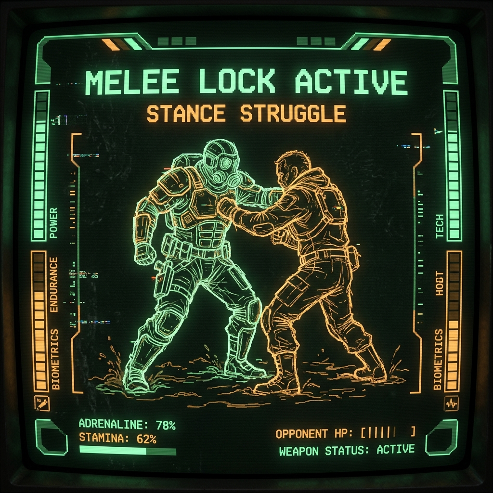

# ARCCROSS Combat UI Specification

The combat UI presents CombatCore snapshots and emits player intent. It does not
calculate AP costs, legal actions, targets, reactions, or outcomes.

## Tactical Lane

- Render the twelve-slot lane as a receding monospace wireframe corridor.
- Keep player, enemy, terrain, and cover markers distinguishable by both glyph
  and color.
- Preserve exact lane positions even when perspective compresses distant slots.
- Show the active combatant, AP, Reserved AP, Stance, and immediate biological
  danger without covering the lane. Label the current Stance State instead of
  relying on the numeric value alone.
- Show every Limb Region's current and maximum Structural Integrity separately
  from systemic Blood Level. Mark active Trauma without treating Blood as total
  HP.
- Mark Recovery Guard while its temporary anti-knockdown floor is active.
- For the equipped ranged weapon, show current rounds, capacity, effective
  range, and whether CYCLE is required before another shot.

## Melee Lock



When hostile combatants share a lane slot, replace the corridor center with a
front-view lock overlay. Keep legal actions and AP visible. Restore the corridor
when the lock ends.

## Controls

- Anchor a dynamic action dock at the bottom of the screen.
- Display only owner-validated legal actions and their exact AP costs.
- Support both pointer input and visible keyboard shortcuts.
- Request target limbs or Runtime Item Instance IDs only after an action requires
  them.
- Disable input while a command is awaiting authoritative resolution.

## Impact Feedback

- Flash the struck anatomical region and update its value immediately.
- Use brief camera or panel shake for meaningful impacts, not every log entry.
- Distinguish Flesh Damage, Stance Damage, collapse, and death visually.
- Do not present ballistic impact as Stance loss; firearm hits update the
  resolved Limb Region.
- Keep the combat log readable after effects finish.

## Reaction Window

When CombatCore exposes a reaction:

```text
[!] REACTION WINDOW - INCOMING ATTACK [!]
[ DODGE (AP) ]  [ BLOCK (AP) ]  [ PASS ]
```

- Dim normal controls and pause turn advancement.
- Show only legal reactions with authoritative costs.
- Close the overlay only after the selected response resolves.
- Never spend AP or infer reaction availability inside the UI.
