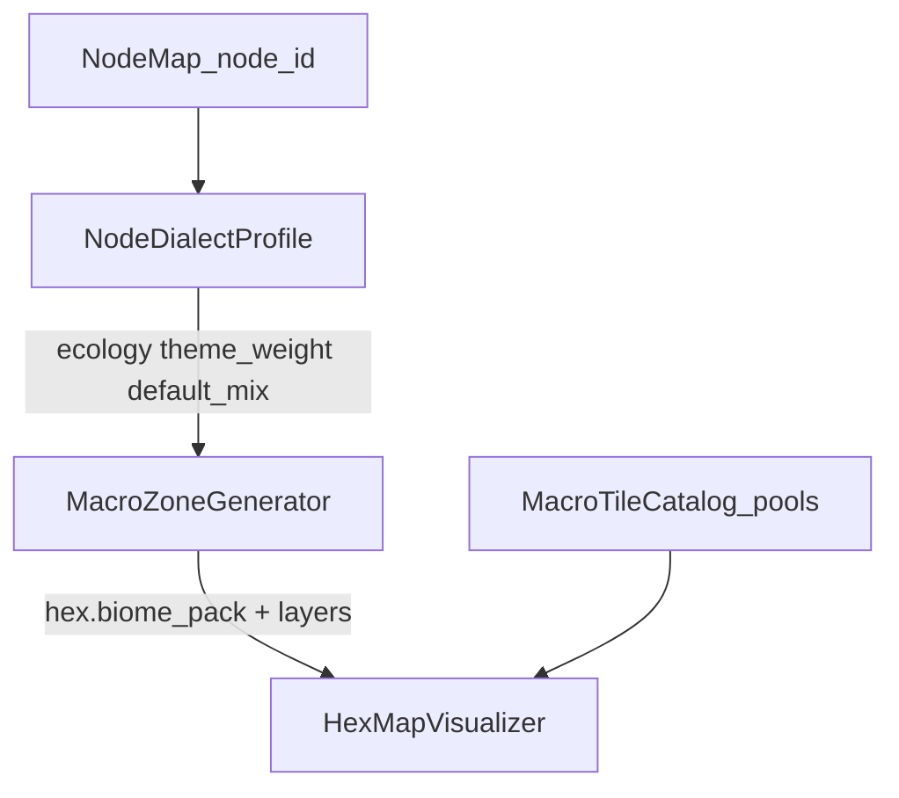

# Hex World Asset Overhaul

**Status:** Official asset → Node Map → hex-zone implementation plan.  
**Locks:** [World Timeline Codex](../WORLD_TIMELINE_CODEX.md) chronology ·  
[Macro World Overhaul](MACRO_WORLD_OVERHAUL.md) Node Web ·  
[Hex Dressing Templates](HEX_DRESSING_TEMPLATES.md) FRAME/CORE ·  
[Central Core Campaign Overhaul](CENTRAL_CORE_CAMPAIGN_OVERHAUL.md) Act 1 seals.

Where this file conflicts with older S:→biome sort tables (including the asset
pipeline table previously embedded in Central Core Campaign Overhaul), **this
file wins for asset identity and generator dialect**.

---

## Goal

Make the Directional Node Web and radius-12 hex generator produce an Era 9
**Glitch** world from real packs:

1. **Theme packs** define Arm ecological + institutional identity.
2. **Golbanc** is the **Era 8 default vernacular** (homesteads / ordinary
   settlement), not an Arm theme.
3. **Alpha journey:** nodes next to Central = homestead starters; theme weight
   ramps toward each Arm Core (e.g. North = snow overtaking plains).

---

## Locked pack roles

| Source on `S:\Asset\_Asset` | Role | `pool_id` / dialect | Notes |
| --- | --- | --- | --- |
| Brutalist Metropole + `central_core*` | Theme — **Central** | `central` | Already in `biome_centralcore` |
| Archology South | Theme — **South** | `south` | Dock / logistics city |
| Arid Badlands | Theme — **West basin** | `west_basin` | Surface extraction |
| Exo-Lunar Desolation | Theme — **West deep / Man-Eater** | `west_deep` | Sealed Arc-plant / Gap oxide; not “space” |
| `_BIOMES\biomes_snow` | Theme — **North** | `north` | Gallian pack folder is empty — use this |
| Hercynian Lowlands | Theme — **East wet lowlands** | `east` | Mud / wetland pressure |
| **Golbanc Homestead** | **Default Era 8 structures** | `default_era8` | Shared across all arms |
| Gloria Station | Shared props (crates) / shelf halls | `shared_props` | Crates now; halls later |
| Starlight Menagerie | Shared props / later AI / shelf mechs | `shared_props` / `_shelf` | Vehicles + barricades now |
| `HEXIFY/` | Prefer hex-ready dupes when present | — | Archive junk separately later |

### Ecological extremes (readable Arm outdoor language)

| Arm | Extreme | Theme terrain |
| --- | --- | --- |
| Central | Urban concrete / density | Brutalist |
| North | Ice / arctic | snow biome |
| West | Desert basin + sealed mountain | Arid + Exo |
| East | Wet lowlands / mud | Hercynian |
| South | Coastal / archology density | Archology |

---

## Alpha release — visual journey rule

```text
[Arm Core]     theme dominant
     ↑
[mid nodes]    mix theme + Golbanc
     ↑
[*_random_1]   Golbanc homestead starter (~80–100% default)
     ↑
[CENTRAL]      Brutalist hub (authored)
```

| Node depth | `default_era8` (Golbanc) | Arm theme | Intent |
| --- | --- | --- | --- |
| `central_core` | rare | `central` 100% authored | Eviction seat / hub stamp |
| `*_random_1` (next to Central) | 80–100% | 0–20% hint only | **Starter areas** — shared tutorial grammar |
| mid (`*_random_2..3` / approaches) | ~50% | ~50% | Player feels the Arm waking up |
| `*_gateway` | ~20% | ~80% | Theme readable |
| `*_core` | low | theme + Core landmark | Destination identity |

**North example:** terrain lerps plains/Golbanc grass → snow hexes; structures
stay Golbanc longer than terrain (sheds in snow = Era 9).

Act 1 shipping may still **hard-seal E/S/W** travel
([Central Core Campaign Overhaul](CENTRAL_CORE_CAMPAIGN_OVERHAUL.md)). The
**same mix rule** applies; only North path is playable until seals lift.

---

## Architecture — Node Map → zone → tiles



### NodeDialectProfile (data contract)

Per node (or per arm × depth band):

| Field | Purpose |
| --- | --- |
| `arm` | `central` \| `north` \| `east` \| `south` \| `west` |
| `ecology` | `urban` \| `ice` \| `desert` \| `wet_lowland` \| `coastal` \| `west_deep` |
| `theme_pool` | pack id for terrain + theme structures |
| `default_pool` | always `default_era8` except pure Central hub / west_deep |
| `theme_weight` | 0.0–1.0 from alpha table above |
| `glitch_rate` | rare wrong-pack scraps (Era 9) |
| `landmark_pool` | POI / CORE stamps for that band |

Generator must **not** hardcode “everything is plains.”  
`hex.biome_pack` (or split `terrain_pack` + `structure_pack`) must follow the
profile.

### Catalog pools (expand beyond `plains` / `centralcore`)

| Pool id | Feeds |
| --- | --- |
| `central` | terrain + Brutalist structures |
| `north` | snow HEX + northern scraps |
| `east` | Hercynian mud/wet + wet structures |
| `south` | Archology terrain/structures |
| `west_basin` | Arid terrain/rocks/structures |
| `west_deep` | Exo (Man-Eater / Gap nodes later) |
| `default_era8` | Golbanc structures (and mild grass if needed) |
| `shared_props` | Gloria crates, Menagerie barricades/vehicles |

`Tools/Build-HexTileSet.gd` path heuristics and `GameEnums.BIOME_PACK_*` must
grow to match. Structure resolution: if roll = vernacular → sample
`default_era8` even when terrain pack is `north`.

---

## Project folder taxonomy

Under `res://Asset/HexTiles/_BIOMES/`:

```text
biome_centralcore/     # exists
biome_north/           # from biomes_snow (+ curated)
biome_east/            # Hercynian
biome_south/           # Archology
biome_west_basin/      # Arid
biome_west_deep/       # Exo (later)
default_era8/          # Golbanc — structures primary
shared_props/          # crates, barricades, vehicles
_shelf/                # Gloria halls, mechs, unused
```

Per biome / pool:

- `HEX/` — terrain-only bases (512² preferred)
- `Infrastructure/` — OVERLAY / FRAME (roads, tanks, poles)
- `Structures/` — CORE footprints
- `flora/`, `Rocks/`, `remnants/`, `water_*` as needed

**Do not** bake roads into terrain HEX. Roads = OVERLAY backlog (hex-edge set
covering all iso axes — separate task after dialect wiring).

---

## Sort SOP (S: → project)

1. Classify each PNG: terrain / structure / overlay / prop / shelf / discard  
2. Prefer HEXIFY when duplicate exists  
3. Copy into pool folder with stable `snake_case` names  
4. Tag dressing pools (CORE / FRAME / ACCENT / OVERLAY)  
5. Rebuild TileSet + `MacroTileCatalog`  
6. Smoke: same `zone_seed` → same placement  

Promote order for alpha:

1. `central` (done / harden)  
2. `default_era8` (Golbanc structures)  
3. `north` (snow)  
4. `shared_props` (crates, barricades)  
5. east / south / west_basin when arms unlock  
6. `west_deep` with Man-Eater nodes  

---

## Generator work (code owners)

| Area | Job |
| --- | --- |
| Profile table / resource | Map `node_id` → `NodeDialectProfile` |
| `MacroZoneGenerator` | Use profile for terrain + structure_mix; stop all-plains default |
| `HexMapVisualizer` / catalog | Resolve theme terrain + `default_era8` structures |
| `Build-HexTileSet.gd` | Multi-pack path → pool ids |
| `GameEnums` | New `BIOME_PACK_*` / pool constants |
| Dressing templates | Roles tagged `central`, `north`, `default_era8`, … |
| Composition plan | Ring budgets; starter nodes homestead-heavy |

Presentation emits visuals only. Travel seals / Meta flags stay WorldCore /
SystemCore ([Central Core](CENTRAL_CORE_CAMPAIGN_OVERHAUL.md)).

---

## Phased build order

### Phase A — Docs lock (this file)

- Point Central Core asset table here; link from docs index  
- **Done when:** agents use this file for pack identity  

## Phase B — Alpha pools on disk (Central + plains homestead + north snow)

- Sort Golbanc → `default_era8/` (homestead structures from plains)  
- Sort snow → `biome_north/` (`HEX/snow_tiles`, Rocks, Structures)  
- Harden `biome_centralcore/` taxonomy  
- Rebuild catalog via `Tools/Build-HexTileSet.gd`  
- **Done when:** Godot loads central + plains + default_era8 + north sources  

### Phase C — Dialect profiles + generator mix

- `WorldCore/NodeDialectProfile.gd` — adjacent ring homestead; North snow ramp  
- `MacroZoneGenerator` applies theme_weight → `SNOW_TRANSITION` / pack ids  
- Stub E/S/W as plains homestead until those packs ship  
- **Done when:** North approach reads Golbanc→snow ramp at fixed seed  

### Phase D — Dressing templates

- 6–8 templates: Central hub + north homestead + north cold mid  
- FRAME fixed; CORE from `default_era8` / `north` pools  
- **Done when:** same seed stable FRAME; CORE varies by weight  

### Phase E — Arm expansion (post–Core meta / seal lift)

- Promote east / south / west_basin  
- Same depth mix curve as North  
- `west_deep` only on Man-Eater / Gap special nodes  
- **Done when:** each Arm Core has readable extreme  

### Phase F — Infrastructure overlays

- Hex-edge road set (all iso axes), then pipes/power  
- Vignette-only until complete  
- **Done when:** trails use OVERLAY stubs without baking into HEX  

---

## Non-goals

- Mass-renaming all of `S:\Asset\_Asset` before Phase B promote  
- Treating Golbanc as “East theme”  
- Using empty Gallian Ice Field pack SKU (use `_BIOMES\biomes_snow`)  
- Exo as orbital tourism biome  
- Mechs / Gloria halls in alpha  
- Four full arms playable in Act 1 if travel seals remain locked  

---

## Success criteria

- Node next to Central = homestead starter language (Golbanc)  
- Arm Core approach = that Arm’s ecological theme readable  
- Golbanc appears on multiple arms as Era 8 default, not one faction  
- Catalog + generator speak in pool ids aligned to this doc  
- Act 1 can ship Central + North ramp without waiting for all packs  
- Props never author blockers / travel / POI authority  

---

## Cross-links

- Chronology: [World Timeline Codex](../WORLD_TIMELINE_CODEX.md)  
- Act 1 seals / eviction: [Central Core Campaign Overhaul](CENTRAL_CORE_CAMPAIGN_OVERHAUL.md)  
- Node Web: [Macro World Overhaul](MACRO_WORLD_OVERHAUL.md)  
- Dressing schema: [Hex Dressing Templates](HEX_DRESSING_TEMPLATES.md)  
- Builder: [`Tools/Build-HexTileSet.gd`](../../Tools/Build-HexTileSet.gd)  
