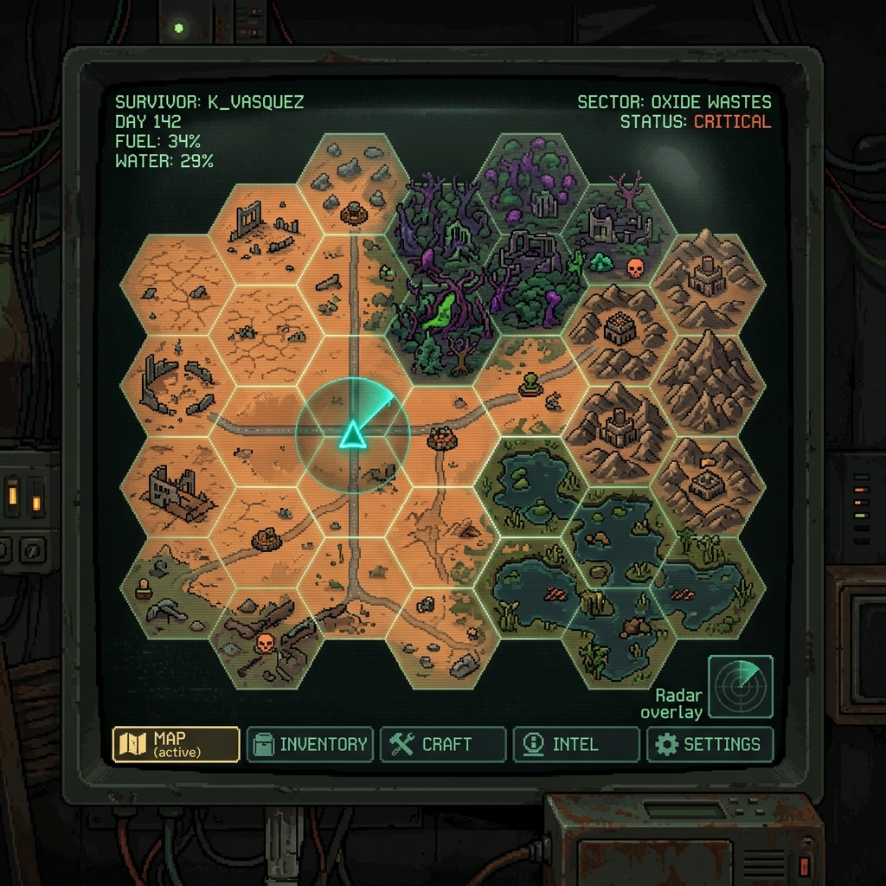
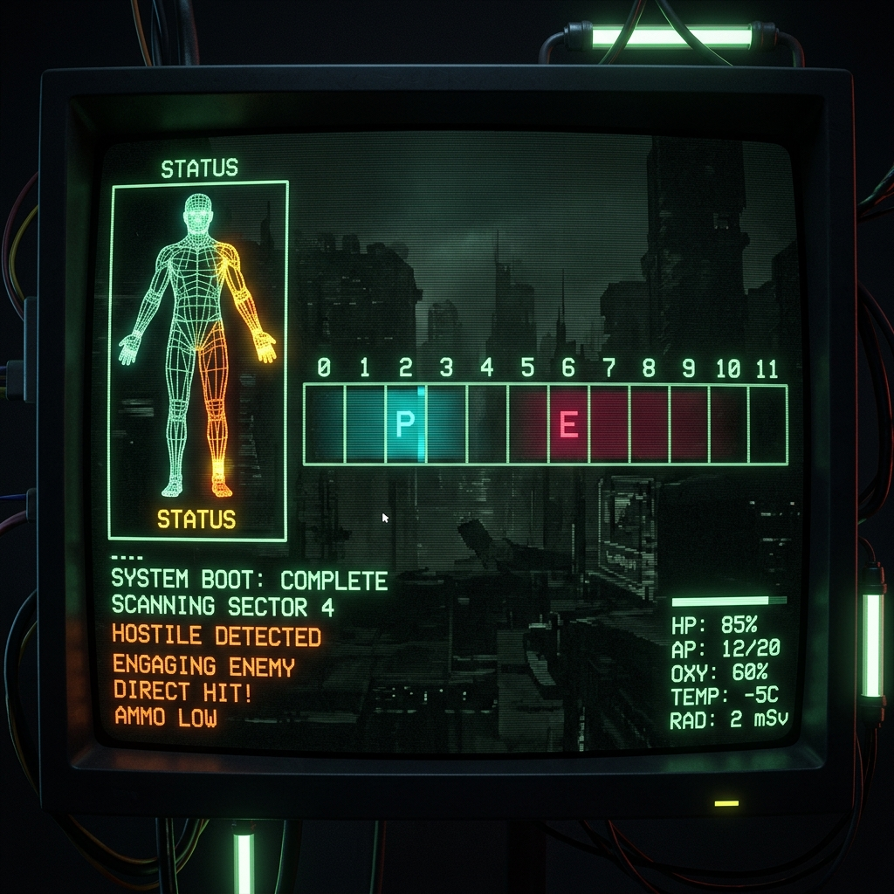
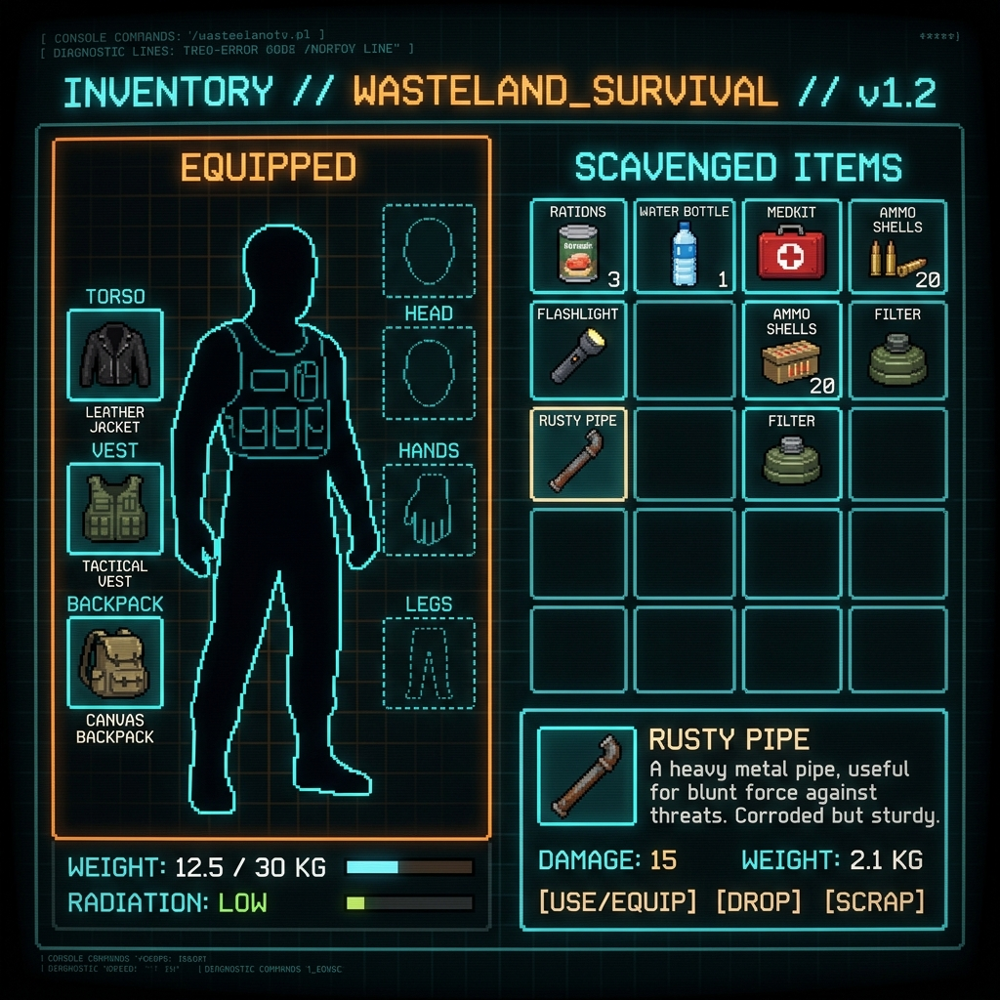
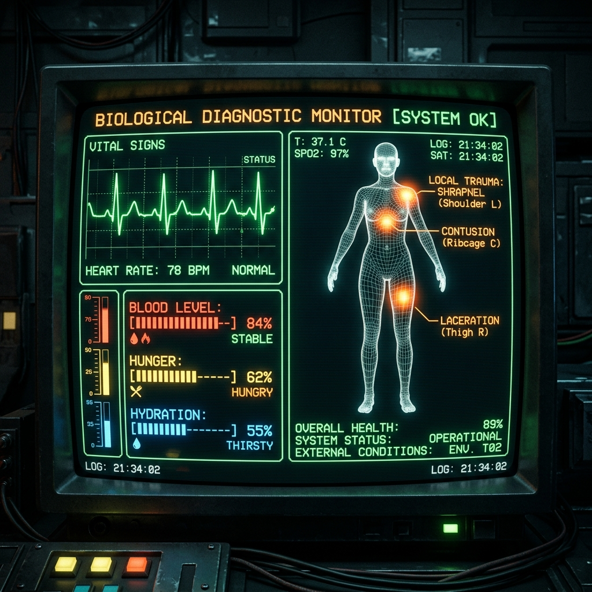

# ARCCROSS Visual Direction

ARCCROSS uses a severe retro-tactical interface: dark fields, monospace
readouts, wireframe anatomy, and restrained high-contrast alerts. Presentation
should make systemic consequences legible without owning gameplay rules.

See [Combat UI Specification](COMBAT_UI_SPECIFICATION.md) for combat-specific
layout.

## Visual Language

- **Normal information:** cyan or desaturated teal.
- **Caution:** amber.
- **Immediate danger:** crimson.
- **Red Mist or anomalous effects:** magenta.
- **Typography:** compact monospace labels with clear numeric hierarchy.
- **Motion:** short, local feedback tied to an event; avoid constant movement
  that competes with decision-making.
- **Texture:** scanlines, phosphor glow, fog, and distortion should remain subtle
  enough to preserve readability.

## Presentation Contract

HUDs display owner-produced snapshots and emit intent through stable command or
item IDs. Visual replacement must not require gameplay rewiring. The full rule
is defined in [System Architecture](../SYSTEM_ARCHITECTURE.md).

The combat HUD uses timeline events from `RealtimeDuelRuntime`, layered
humanoid animations, ItemCore weapon state, projectile/blood effects, and
cinematic camera profiles. The old Phase 2 bottom command deck is historical,
not a second gameplay surface.

## Macro Map

- Distinguish explored, visible, and unknown Hexes immediately.
- Use a restrained Red Mist overlay for fog of war.
- Movement feedback should communicate terrain cost and environmental danger.
- POIs require silhouettes that remain recognizable at map scale.

## Exploration HUD

- Keep location, time, immediate biology, and available interactions visible.
- Reserve full-screen flashes for severe trauma, collapse, or encounter
  transitions.
- Present warnings as specific conditions, not generic danger decoration.

## Inventory

- Separate equipped slots, backpack contents, and ground items.
- Show Capacity, Size Cost, Weight, and overflow risk without hiding the items.
- Use a body silhouette to make equipment location readable.
- Spill warnings must identify what changed and where displaced items went.

## Medical Monitor

- Present local limb structure separately from systemic Blood, fatigue,
  temperature, hunger, and thirst.
- Color communicates severity; labels and values remain available without color.
- A damaged region may flash or shake briefly when updated.
- Crisis effects should identify bleeding, exhaustion, hypothermia, or Red Mist
  corruption rather than applying an undifferentiated vignette.

## Loot And Encounters

- Item presentation should emphasize the properties relevant to survival:
  Capacity cost, Weight, protection, Threat, ammunition, and condition.
- Loot notifications should be brief and must not interrupt repeated transfers.
- Entity collisions may introduce a portrait, identity, and current disposition
  before TALK or AMBUSH choices.
- Negotiation feedback should clearly show the selected action and result.

## Asset Policy

- Placeholder and generated assets are acceptable for the demo.
- Store references inside the repository; do not link to local tool caches.
- Prefer a small coherent asset set over many unrelated styles.
- Presentation assets must remain replaceable without changing domain logic.
