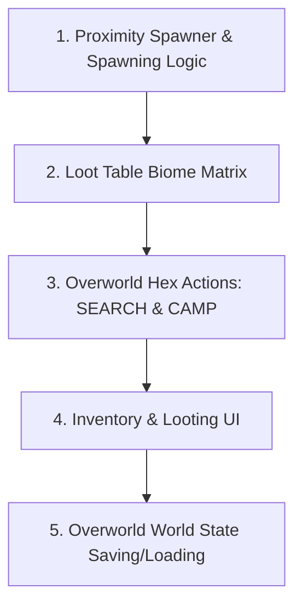

# Phase 1 Readiness Assessment: Mechanical Architecture

We have completed a comprehensive audit of the `arccross_system` codebase against the **🛠️ Tech Demo Spec Sheet: Mechanical Architecture**. Below is a detailed evaluation of what is ready, what is partially implemented, and what is missing.

---

## Executive Summary

> [!IMPORTANT]
> **Can you start hooking up placeholder assets?**
> **Yes.** You have a functional overworld grid renderer, basic player/enemy tokens, and a fully functional backend combat arena. You can begin importing tileset textures and token sprites.
>
> **Can you finish Phase 1 with the current code?**
> **No.** Several critical systems required by the Spec Sheet are either entirely missing or stubbed out. You must implement the **Proximity Spawner**, **Loot Tables**, **Hex Actions (SEARCH/CAMP)**, and the **Loot & Inventory UI** before you can call Phase 1 complete.

---

## Feature-by-Feature Gap Analysis

### 1. World Generation & Spatial Optimization

| Spec Feature | Code Location | Status | Assessment / Required Work |
| :--- | :--- | :--- | :--- |
| **The Macro Hex Map** | [HexWorldGenerator.gd](file:///c:/Users/Zerato/OneDrive/Documents/arccross_system/WorldCore/HexWorldGenerator.gd) [HexMapVisualizer.gd](file:///c:/Users/Zerato/OneDrive/Documents/arccross_system/WorldCore/HexMapVisualizer.gd) [MacroGameManager.gd](file:///c:/Users/Zerato/OneDrive/Documents/arccross_system/WorldCore/MacroGameManager.gd) | **90% Complete** | Procedural map generation using cellular noise and basic tile navigation is fully functional. **Next Step:** Limit movement options to actual adjacent hexes (currently uses hardcoded `HEX_NEIGHBORS` relative positioning but does not dynamically block movement if blocked or invalid). |
| **Proximity Spawner** | *Not Implemented* | **0% Complete** | **Missing.** Currently, enemies are hardcoded in [MacroGameManager.gd:L38-42](file:///c:/Users/Zerato/OneDrive/Documents/arccross_system/WorldCore/MacroGameManager.gd#L38-L42). There is no mechanism to instantiate, load, or garbage-collect entities based on player hex radius. This needs to be written to satisfy the garbage collection benchmark. |
| **Hex-Specific Actions (SEARCH)** | *Not Implemented* | **0% Complete** | **Missing.** There is no code handling localized skill checks, time-progression costs, or rolls on loot tables. |
| **Hex-Specific Actions (CAMP)** | *Not Implemented* | **0% Complete** | **Missing.** There is no mechanism to "secure" a hex, rest, heal, or open an overworld inventory screen. |

### 2. Inventory & State Persistence (The Loot Loop)

| Spec Feature | Code Location | Status | Assessment / Required Work |
| :--- | :--- | :--- | :--- |
| **The Loot Table** | *Not Implemented* | **0% Complete** | **Missing.** While [MobSpawner.gd](file:///c:/Users/Zerato/OneDrive/Documents/arccross_system/SystemCore/MobSpawner.gd) has a randomized faction gear generator, there is no overworld loot matrix mapping item drops to specific biomes (e.g., Ruins vs. Forest). |
| **Permanent Item HUD & World State** | [MacroGameManager.gd](file:///c:/Users/Zerato/OneDrive/Documents/arccross_system/WorldCore/MacroGameManager.gd) [GameDirector.gd](file:///c:/Users/Zerato/OneDrive/Documents/arccross_system/SystemCore/GameDirector.gd) | **40% Complete** | **Partially Implemented.** [MacroGameManager.gd](file:///c:/Users/Zerato/OneDrive/Documents/arccross_system/WorldCore/MacroGameManager.gd) tracks dropped items using the `active_map_remnants` dictionary. However:  1. There is no file serialization/deserialization (saving/loading coordinates to disk). 2. There is no visual representation of dropped items on the map (no HUD/marker on the hex). 3. There is no way for the player to drop items manually. |
| **Loot & Inventory UI** | *Not Implemented* | **0% Complete** | **Missing.** The inventory system ([InventorySystem.gd](file:///c:/Users/Zerato/OneDrive/Documents/arccross_system/ItemCore/InventorySystem.gd)) has the data logic (adding, equipping, spilling items), but there is zero graphical UI to let players drag, discard, or transfer items between Ground/Chests and their inventory. |

### 3. The Combat System

| Spec Feature | Code Location | Status | Assessment / Required Work |
| :--- | :--- | :--- | :--- |
| **The Funnel & Transition** | [GameDirector.gd](file:///c:/Users/Zerato/OneDrive/Documents/arccross_system/SystemCore/GameDirector.gd) [MainDuelScene.gd](file:///c:/Users/Zerato/OneDrive/Documents/arccross_system/CombatCore/MainDuelScene.gd) | **85% Complete** | The transition loop is working well: overworld collision $\rightarrow$ suspend overworld $\rightarrow$ run combat duel $\rightarrow$ resolve and clean up $\rightarrow$ return to overworld. **Missing:** The "Proximity Spawn (Enemy Appears)" trigger before engagement. |

---

## What is Ready for Placeholder Assets?

You can start creating and assigning placeholder assets for the following components immediately:

1. **Overworld Hex Tiles**:
   * You already have textures loaded in [main_world.tscn](file:///c:/Users/Zerato/OneDrive/Documents/arccross_system/WorldCore/main_world.tscn) (e.g., `forest_01_full.png`, `forest_12_hill.png`). You can define more distinct tiles for Plains, Forest, Hills, Mud, and Swamp.
2. **Player and Enemy Tokens**:
   * Modulate-tinted sprites are set up in [MacroEnemy.gd](file:///c:/Users/Zerato/OneDrive/Documents/arccross_system/WorldCore/MacroEnemy.gd). You can substitute these with actual character icons.
3. **Combat Scene Layout**:
   * The combat system resolves in [MainDuelScene.gd](file:///c:/Users/Zerato/OneDrive/Documents/arccross_system/CombatCore/MainDuelScene.gd). While the backend is robust, the current UI is just a [RichTextLabel](file:///c:/Users/Zerato/OneDrive/Documents/arccross_system/CombatCore/MainDuelScene.gd#L11). You can start designing a visual combat layout.

---

## Actionable Roadmap to Complete Phase 1

To bridge the gap and finish Phase 1, we suggest implementing the missing systems in this order:

### Step 1: Proximity Spawner & Dynamic Loading
* Modify [MacroGameManager.gd](file:///c:/Users/Zerato/OneDrive/Documents/arccross_system/WorldCore/MacroGameManager.gd) to instantiate and free enemies / hazard tokens dynamically when they enter/exit a radius of $N$ hexes around the player.

### Step 2: Biome-Based Loot Tables
* Create a simple data-driven loot matrix (e.g., a dictionary resource or script mapping `GameEnums.GridBiome` to arrays of `ItemData` weights) so searching ruins yields metal/parts, while forests yield wood/food.

### Step 3: SEARCH & CAMP Actions
* Create a simple overworld actions UI overlay.
* **SEARCH**: Perform a quick skill check (e.g. Finesse or Wits roll), advance the overworld biological clock (drain hunger/thirst/temperature), and add rolled loot to the hex remnants.
* **CAMP**: Recover stance points, sleep (reduces fatigue), use consumables, and open the inventory UI safely.

### Step 4: Ground / Chest / Player Inventory UI
* Create a control panel that renders:
  1. Left panel: Player equipped gear (paper doll) and backpack space.
  2. Right panel: Container contents (Ground or Chest contents).
  3. Drag-and-drop or click-to-transfer buttons to swap items.
